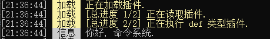

# DotCS 社区版插件帮助文档

## 一    前言

欢迎阅读 **DotCS 社区版** (下文简称社区版) 官方文档, 本文档将介绍 **DotCS 社区版插件** (下文简称插件).
插件语言: Python
官方插件作者: 7912
社区版官方选装插件可在 https://www.dotcs.community/ 下载
其中很多插件做得很差, 因为...我Python最基础的部分都没掌握好
我试着尽量完成这篇文档, 可能这篇文档也写得不太好. 我在此说声抱歉...

## 二    路径

> "**.**" 代表 robot.exe 所在目录.

| 文件                 | 路径                                                      |
| :------------------- | :-------------------------------------------------------- |
| 插件                 | ./plugin/                                                 |
| 插件配置信息 (建议) | ./plugin/data/插件名/ 或 ./status/ 或 插件内部的def类型中 |
| 玩家数据 (建议)     | ./player/玩家名称/数据名称.txt                            |

## 三    类型

|    插件类型    | 介绍                                                   | 补充说明                                                                    |
| :------------: | :----------------------------------------------------- | :-------------------------------------------------------------------------- |
|      def      | 在读取全部插件到列表后, FastBuilder 启动前执行         |                                                                             |
|      init      | 在 FastBuilder 连上租赁服, 收到第一个数据包后执行      |                                                                             |
| player prejoin | 在玩家正在加入租赁服(正在生成世界, 定位服务器)时执行   | 在这个插件类型中, 通常情况下对这位玩家执行的指令是无效的, 毕竟玩家还未进服. |
|  player join  | 在玩家已经进入租赁服(正在生成世界, 正在加载资源)后执行 |                                                                             |
|  player leave  | 在玩家已经退出租赁服后执行                             | 在这类插件中, 对这位玩家执行的指令是无效的. 毕竟玩家已经退出了.             |
|   repeat xx   | 每隔 xx 时间执行一次                                   | 支持的xx有: 1s, 10s, 1m.                                                    |
|   packet xx   | 在收到 xx 号数据包时执行                               | xx为数据包的编号, -1 代表全部包                                             |

> 所有插件类型将一起使用**单线程**执行, 所以**请不要在插件内部** (def插件类型除外) **直接进行费时间的操作** (time.sleep等), 否则会造成阻塞. 如有需求请自行创建新线程.

## 四    插件制作

---

### 0. 插件格式

```python
# 作者: 7912
# 描述: 这是一个插件示例.
# ...: ...


# PLUGIN TYPE: 插件类型1
...


# PLUGIN TYPE: 插件类型2
...


```

> 注意: 同一个插件内, 插件类型不可重复.
>
> 社区版读取插件后会将插件以 "# PLUGIN TYPE: " 分割, 来确定每一处插件代码应在什么时候被执行.
>
> 也就是说, 第一个 "# PLUGIN TYPE: " 以前的内容会被忽略 (即上方代码 1~6 行), 这部分可以想写什么就写什么, 但还是建议按上方格式书写.

> 在后文的插件代码中, 我将省略插件开头的描述信息.

---

### 1. "你好, 命令系统" | color 函数基础

现在, 你已经了解了插件的基础信息, 让我们一起制作第一个插件吧.

和大多数语言一样, 我们首先学会在社区版控制台输出内容.

以下为color函数的说明:

```python
color(text: str, output: bool = True, end: str = "\n", replace: bool = False, replaceByNext: bool = False, info = " 信息 ")
"""
在命令系统控制台输出信息
---

参数:
    text: str -> 要输出的内容.
    output: bool -> 是否输出.
    end: str -> 输出时末尾的字符, 同print()中的.
    replace: bool -> 覆盖输出1
        True: 若下次输出 replace=True, 则这次输出将被覆盖, 否则不会被覆盖.
        False: 普通的输出.
    replaceByNext: bool -> 覆盖输出2
        True : 这次输出将被下次输出覆盖.
        False: 普通的输出.
    info: str -> 输出内容前的反色信息.

返回: str -> 输出
"""
```

---

感觉有些难理解..?, 没关系, 我们先试试最基础的输出.

```python
./plugin/helloworld.py

# PLUGIN TYPE: def
color("你好, 命令系统.")
```



这样就成功了.

> 建议使用color函数进行输出. 在社区版中, 使用print进行输出还是会使用color函数
>
> Python 原版的 print 输出函数被更改为 print_Py (不建议使用)

---

#### 1.1. 更好地说"你好" | color 函数深入

接下来, 我们应该用用color中的参数了

往上看看 color 的 replace 参数:

> replace: bool -> 覆盖输出
>
>> True: 若下次输出 replace=True, 则这次输出将被覆盖, 否则不会被覆盖.
>>
>> False: 普通的输出.
>>

也就是说, 可以使用replace = True进行覆盖输出, 避免刷屏

我们一步步来, 先做一个伪进度百分比显示试试.

```python
./plugin/progress.py

# PLUGIN TYPE: def
progress = 0
while progress < 100:
    color("§e正在加载: "+str(progress)+"%", replace = True, info = "§e 加载 ")
    progress += 1
    time.sleep(0.1)
color("§a已完成", info = "§a 成功 ")
```


怎么样.., 是不是很简单..?, 接下来我们一起更详细地了解不同插件类型以及玩家信息的判定.

---

### 2. "你好, 玩家. 这里是命令系统" | player message 类插件基础

现在, 我们来了解怎样制作与玩家互动的插件.

学习这些之前, 我们应该要知道怎样与玩家互动 (发送指令)

#### 2.1 "FastBulider, 请向租赁服传达我的指令" | sendcmd 函数基础

同样地, 我们来看看 sendcmd 函数的定义:

```python
sendcmd(cmd: str, waitForResponse: bool = False, timeout: float | int = 1)
"""
以 WebSocket 身份发送指令到租赁服的函数
---

参数:
    cmd: str (Minecraft command) -> 要在租赁服执行的指令.
    waitForResponse: bool -> 是否等到收到命令执行结果再返回结果.
        False: 不等结果, 直接返回命令执行的uuid. `(一瞬间)`
        True : 等到收到结果了再返回结果. `(需要1~2游戏刻)`
    timeout: number -> 等待返回结果的最长时间

返回:
    `waitForResponse = False`:
        str : 命令执行的uuid.
    `waitForResponse = True `:
        Dict: 命令执行的返回结果.

报错:
    TimeoutError: 等待命令执行结果超时.
"""
```

未完待续
---